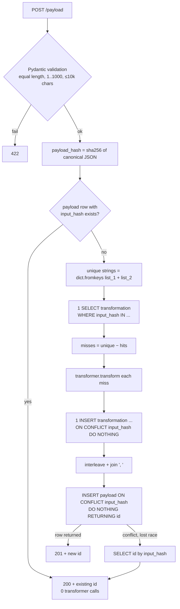

# RFC: Caching Service — Payload Generation with a Postgres-Backed Transformer Cache

- **Author(s)**: @odubrovyk
- **Created**: 2026-10-01
- **Status**: Draft
- **Scope**: new repo `caching-service` (FastAPI app + `cache-cli`). No existing service touched.
- **PRD**: `docs/00-prd-delta.md` · **Spec**: `docs/02-spec.yaml` · **Tests**: `docs/03-test-checklist.md` ·
  **Plan**: `docs/04-tasks.md`

---

## 📘 Summary

A FastAPI microservice builds a payload from two equal-length string lists. Each string goes through a
**transformer** (a stand-in for an external service; here `str.upper()`), and the transformed strings are
interleaved into one output. It returns an identifier, and the payload can be read back by that
identifier. Transformer results are cached **in Postgres**, keyed by a hash of the input string. Strings are
de-duplicated inside each request, and a payload identifier is reused when the same input comes again, so
each distinct string is transformed at most once (except for one accepted concurrency race). A
Pydantic-Settings CLI, `cache-cli`, drives the service.

## 🎯 Goals

- Fewer transformer calls: **calls == distinct strings ever seen**, excluding concurrent first-sight races.
- Same input → same identifier, always.
- Fixed number of database statements per request, regardless of list size (no per-string queries).
- Production-quality code: layered, typed, tested at unit and integration level.

**Non-goals**: extra cache tiers, expiry, auth, deletion, Kubernetes manifests (see PRD §5).

---

## 🧠 Background

The brief ([Notion](https://dune-dinner-167.notion.site/Python-Backend-Caching-Service-1832fabcbb3f808f8627c77eb978bae4))
asks for:

1. Endpoints to create and read generated payloads. Create returns an id, read returns the payload.
2. Payload = interleaving of transformed `list_1` / `list_2` strings.
3. Transformer outcomes cached and reused, with the payload id reused for repeated inputs, and the
   number of transformer calls kept to a minimum.
4. Cache stored in SQLite or **PostgreSQL** (we choose Postgres: real concurrency semantics for `ON CONFLICT`).
5. A CLI tool using Pydantic Settings for argument parsing and validation.
6. FastAPI, SQLModel or **SQLAlchemy** (we choose SQLAlchemy 2.0 declarative), and Docker.

Sample: `list_1 = ["first string", "second string", "third string"]`,
`list_2 = ["other string", "another string", "last string"]` →
`"FIRST STRING, OTHER STRING, SECOND STRING, ANOTHER STRING, THIRD STRING, LAST STRING"`.

### Gaps in the brief, resolved here

| Gap | Resolution |
|---|---|
| `-h` is listed for both `--host` and `--help` | `-h` = `--host`. Help is `--help` only. Done with a custom `argparse` root parser built with `add_help=False`. |
| Empty lists | Rejected with `422`: an empty payload has no meaning, and allowing it would add an edge case for nothing. |
| Size limits | `1 ≤ len(list) ≤ 1000`, each string `≤ 10 000` chars. These are module constants in `caching_service/constants.py`, shared by the server schema and the CLI. Pydantic field constraints are fixed when the class is defined, so making them env-configurable would mean building the schemas at runtime, which is not worth it. The limits protect memory and keep the batched INSERT under asyncpg's 32 767 query-argument limit (2 000 distinct strings × 3 columns = 6 000). |
| Strings Postgres cannot store | A JSON body can carry `\u0000` or a lone surrogate (`\ud800`). Postgres `TEXT` rejects NUL, which would turn into a `500` at insert, so the schema rejects NUL with `422`. Pydantic's own `str` validation already rejects lone surrogates (`string_unicode`). FastAPI's default 422 handler echoes the input back and UTF-8-encodes the body, which crashes on that same surrogate. So the service registers its own `RequestValidationError` handler that returns the same body rendered as ASCII-escaped JSON. |
| Status for a repeated POST | `201` when created, `200` when an existing payload is returned. Both bodies carry `id` + `message`. |
| Join separator | `", "`, read from the sample output. |
| Is order significant for identity? | Yes. Identity is the exact ordered `(list_1, list_2)` pair. Reordering changes the output, so it must change the id. |
| Transformer semantics | Plain `str.upper()`, no latency (decision 2026-10-01). Unicode-aware: `"straße"` → `"STRASSE"`. |

---

## ✅ Design

### Flow — `POST /payload`



At most **5 SQL statements** per POST (payload lookup, transformation select, transformation insert,
payload insert, conflict re-select), whatever the list size. The fast path for a repeated payload is
**1 statement**.

### Flow — `GET /payload/{id}`

One `SELECT output FROM payload WHERE id = :id` → `200 {"output": ...}` or `404`. FastAPI's `UUID` path
type returns `422` for malformed ids before any query runs.

### Hashing

- **Transformation key:** `sha256(value.encode("utf-8")).hexdigest()`, 64 hex chars.
  We hash instead of putting a unique index on the raw text because a Postgres btree index entry is
  limited to about 2.7 KB. A unique index on raw text would make inserts of long strings fail. Raw text is
  still stored in `input_value`.
- **Payload key:** `sha256(json.dumps([list_1, list_2], ensure_ascii=False, separators=(",", ":")))`.
  A JSON array encoding cannot be ambiguous, whereas joining with a separator can:
  `["a,b"]` and `["a","b"]` would collide under `",".join`.

### Transformer client

```python
class TransformerClient(Protocol):
    async def transform(self, value: str) -> str: ...

class UppercaseTransformerClient:
    async def transform(self, value: str) -> str:
        return value.upper()
```

It lives in `clients/`, the layer for external clients, because it stands in for an external
service. It is async so a real HTTP client can replace it later without changing any caller. One instance
is created in `lifespan` and injected. Tests inject a counting fake, and every "minimise calls" claim
rests on that fake's counter.

### Layering

```
api/routes/payload.py          → validate, call use case, map result → HTTP
use_cases/create_payload.py    → orchestrates PayloadService + TransformationService
use_cases/get_payload.py       → orchestrates PayloadService
services/transformation_service.py → dedupe, cache lookup, call transformer for misses, persist
services/payload_service.py    → payload lookup / create (with lost-race handling)
db/repositories/*_repository.py → SQL only
db/models/*.py                 → SQLAlchemy declarative models
clients/transformer_client.py  → TransformerClient protocol + uppercase impl
utils/hashing.py, utils/interleave.py → pure helpers
cache_cli/                     → separate package, entry point `cache-cli`
```

Use cases never touch the DB directly. All runtime deps (engine, sessionmaker, transformer client) are
created once in `lifespan` and injected with `Depends()`.

### Transactions

There is one `AsyncSession` per request. A `yield` dependency commits it on success and rolls it back on
exception. Repositories only `execute`, they never commit.

**The session dependency must be declared `Depends(get_session, scope="function")`.** FastAPI's default
(`scope="request"`) runs the code after `yield` **after the response has been sent**. With that default the
client would get `201` before the commit: a commit failure would be invisible to the client, and a quick
`GET` could `404` on an id it was just given. `scope="function"` runs the commit before the response
leaves. This needs `fastapi>=0.121`, and integration test I-14 pins it by making `commit()` raise and
asserting a `500`. Transformation rows and the payload row
commit together. If the payload insert fails, the transformation rows roll back too. That costs nothing
for correctness: the next request recomputes them.

### Concurrency

- Two requests that miss on the same string at the same moment both call the transformer. Both
  `INSERT … ON CONFLICT DO NOTHING`. Postgres makes the second insert wait for the first transaction and
  then skip the row. The result is one stored row and one extra transformer call. **Accepted.**
- **Insert order matters.** A multi-row `INSERT … ON CONFLICT` takes row locks in row order. Request A
  inserting `[x, y]` while request B inserts `[y, x]` can deadlock: Postgres aborts one, and that client
  gets a `500`. `TransformationRepository.save_many` therefore sorts rows by `input_hash` before inserting,
  so every transaction locks in the same global order (AC-39).
- Two identical POSTs racing: both reach the payload insert, one wins (`201`). The loser gets no
  `RETURNING` row, re-selects by `input_hash`, and answers `200` with the winner's id. The id is the
  same, so the guarantee holds.

### CLI — `cache-cli`

```
cache-cli [-h|--host URL] [-r|--repeat N] [-i|--input FILE|-] [-j|--json JSON] [-o|--output FILE|-] [--help]
```

- `CacheCliSettings(BaseSettings)` with fields `host: AnyHttpUrl = "http://localhost:8000"`,
  `repeat: PositiveInt = 1`, `input_file: str | None`, `json_input: str | None`, and
  `output_file: str = "-"`. Flags come from `AliasChoices("h", "host")`, `("r", "repeat")`,
  `("i", "input")`, `("j", "json")`, `("o", "output")`. Single-letter aliases become short flags. The
  field names avoid shadowing the `input` builtin (ruff `A`).
- Parsed through `CliSettingsSource(root_parser=ArgumentParser(prog="cache-cli", add_help=False))` with an
  explicit `--help` argument, so `-h` is free for `--host`.
- **Environment variables are ignored entirely.** `settings_customise_sources` returns only
  `init_settings`; the CLI source is layered on top by `CliApp.run`. `env_prefix` does **not** apply to
  aliased fields, so without this override a stray `HOST`, `REPEAT` or `OUTPUT` env var on the user's
  machine would silently change the CLI's behaviour.
- A `model_validator` enforces exactly one of `--input` / `--json`. The payload body is then validated
  with the same `list_1`/`list_2` rules as the server (shared schema module), so bad input fails before
  any network call.
- Each iteration: `POST /payload`, then `GET /payload/{id}`, then write one JSON line
  `{"iteration": i, "id": ..., "created": bool, "output": ...}`.
- Exit codes: `0` success, `1` HTTP or connection error, `2` invalid arguments or input.
- `run(settings, http_client, stdin, stdout)` takes an injected `httpx2.Client`. Tests pass Starlette's
  `TestClient(app)` (an `httpx2.Client` subclass) to run the CLI against the real app in-process.

---

## 📊 Impact

| Component | Change |
|---|---|
| `caching-service` repo | New. Python 3.12, `uv`, `ruff`, `black`, `mypy`, `pytest`. |
| Postgres | New DB `caching`. Tables `transformation`, `payload` (Alembic `0001`). |
| Docker | `Dockerfile` (python:3.12-slim + uv), `docker-compose.yml` (`postgres`, `migrations`, `caching-service`). |
| Other infrastructure (queues, caches, search) | None. |
| Existing services | None. |

---

## 🗄️ Data Model / API Contract Changes

### `transformation`

| column | type | notes |
|---|---|---|
| `id` | `BIGINT` identity PK | |
| `input_hash` | `CHAR(64)` NOT NULL | unique, `idx_transformation__input_hash` |
| `input_value` | `TEXT` NOT NULL | raw input, kept for debugging and audit |
| `output_value` | `TEXT` NOT NULL | transformer result |
| `created_at` | `TIMESTAMPTZ` NOT NULL default `now()` | |

### `payload`

| column | type | notes |
|---|---|---|
| `id` | `UUID` PK | generated in the app (`uuid4`), returned to clients |
| `input_hash` | `CHAR(64)` NOT NULL | unique, `idx_payload__input_hash` |
| `output` | `TEXT` NOT NULL | final interleaved string |
| `created_at` | `TIMESTAMPTZ` NOT NULL default `now()` | |

The input lists are **not** stored on `payload`. GET only needs `output`, and the inputs can be
recovered from `transformation` if ever needed. YAGNI.

### API

| Method | Path | Success | Errors |
|---|---|---|---|
| `POST` | `/payload` | `201 {"id", "message": "Payload created"}` / `200 {"id", "message": "Payload already exists"}` | `422` |
| `GET` | `/payload/{id}` | `200 {"output"}` | `404 {"detail": "Payload not found"}`, `422` |
| `GET` | `/health` | `200 {"status": "ok"}` | — |

Full schemas are in `02-spec.yaml`.

---

## 🔄 Alternatives Considered

1. **Redis as the cache.** Rejected. The brief requires DB storage, so Redis would be a second store and
   a second source of truth with no reduction in transformer calls.
2. **In-process LRU (`cachetools` / `lru_cache`) in front of Postgres.** Rejected for now. Each replica
   has its own cache and loses it on restart. It saves a DB round-trip, not a transformer call, which is
   the metric the brief cares about. It is easy to add later behind `TransformationService`.
3. **Response-cache libraries (`fastapi-cache`, `aiocache`).** Rejected. They cache HTTP responses, which
   is the wrong layer: two different payloads sharing a string would still both call the transformer.
4. **Unique index on raw `input_value`.** Rejected because of the btree entry size limit (about 2.7 KB),
   which would fail inserts of long strings. sha256 gives a fixed-width key.
5. **Deterministic id = payload hash (no UUID).** Rejected. It exposes a content hash as the public id,
   which lets anyone check whether a given input exists. A UUID with a unique `input_hash` gives the same
   reuse guarantee.
6. **Advisory lock / single-flight on misses.** Rejected. It adds complexity and latency to every miss to
   save one call in a rare race (see Risks).
7. **SQLModel.** Rejected in favour of SQLAlchemy 2.0 declarative
   (`DeclarativeBase`, `Mapped`, `mapped_column`).
8. **One transformer call per string, run concurrently with `asyncio.gather`.** Not needed for an
   in-memory uppercase. `TransformationService` calls misses one after another. If a real HTTP transformer
   replaces it, bounded concurrency is a contained change.

---

## 🚀 Migration & Rollout Plan

- Greenfield. Alembic revision `0001_create_transformation_and_payload` creates both tables and indexes.
  Its `downgrade()` drops them, so it is fully reversible (and holds no data worth keeping before launch).
- In compose, the `migrations` service runs `alembic upgrade head` once. `caching-service` depends on it
  with `condition: service_completed_successfully`, and `migrations` waits for `postgres` to be
  `service_healthy`.
- No rolling-deploy compatibility concerns: there is one schema version and no consumers.

---

## Non-Functional Requirements

| NFR | Target | Measurement | Verification |
|---|---|---|---|
| Transformer calls | `== count(distinct strings)` across any request sequence without concurrency | Counting fake injected through `Depends` override | Integration tests I-4..I-7 |
| DB statements per POST | `≤ 5` for any list size up to the limit; `1` on the repeat fast path | SQLAlchemy `before_cursor_execute` event counter | Integration test I-9 |
| Bind-param ceiling | Worst-case insert `≤ 6 000` params (< 32 767) | Derived from limits | Review: re-check the arithmetic when raising `MAX_LIST_LENGTH` |
| Startup | `GET /health` 200 within 30 s of `docker compose up` on a dev laptop | compose healthcheck | Manual M-1 |

---

## 🚨 Risks

| Risk | Impact | Mitigation |
|---|---|---|
| Concurrent first-sight of a string | One extra transformer call per racing string | Accepted. `ON CONFLICT DO NOTHING` keeps exactly one row. Documented. |
| Raising `MAX_LIST_LENGTH` above ~5 400 | Batched INSERT exceeds asyncpg's query-argument limit, causing a `500` | At current limits the worst case is 6 000 arguments. Chunk the insert if the limit is ever raised past that. |
| `-h` semantics differ from the brief's literal text | A user typing `-h` expecting help gets "missing URL" | `--help` text states it. Usage line in the README. |
| Output separator ambiguity | A string containing `", "` makes the output impossible to split back | Accepted. The brief defines the output as one string. Clients needing structure should keep their inputs. |

---

## ❓ Open Questions

None open.

Logging is stdlib `logging`, configured once in `lifespan` (level from `LOG_LEVEL`,
default `INFO`). All dependencies come from public PyPI, so `uv sync` and `docker compose up --build` need
no credentials.

---

## 🗺️ Implementation Plan

See `docs/04-tasks.md`. Order: scaffold → pure utils → models + migration → repositories → transformer
client + services → use cases → API → CLI → Docker → README.
